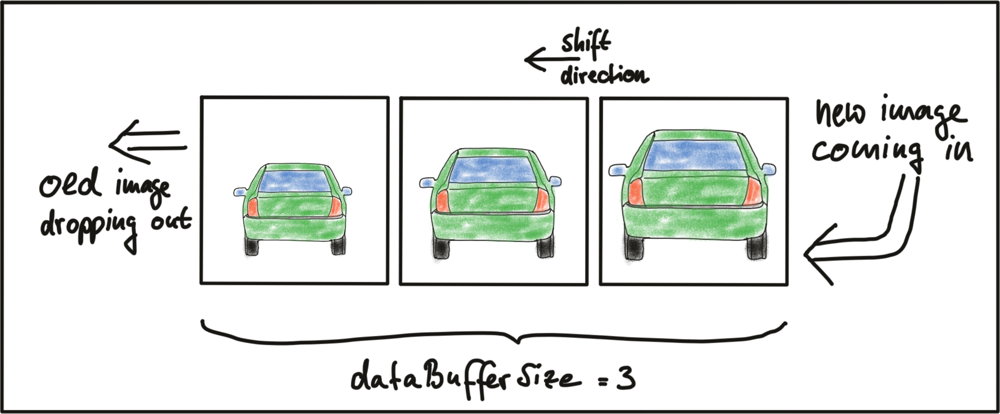

# SFND 2D Feature Tracking

**To build the code**
<pre>
	mkdir build
	cd build
	cmake ..
	make
</pre>

**To Run**
<pre>
	./2D_feature_tracking <detectorType> <descriptorType> <matcherType> <matcherDescriptorType> <selectorType>
</pre>

- detectorType - key point detector, values can be SHITOMASI, HARRIS, FAST, BRISK, ORB, AKAZE, SIFT, default is SHITOMASI.
- descriptorType - key point descriptors, values can be BRISK, BRIEF, ORB, FREAK, AKAZE, SIFT, default is BRISK.
- matcherType - matching algorithm, values can be MAT_BF, MAT_FLANN, default is MAT_BF.
- matcherDescriptorType - matcher descriptor type, values can be DES_BINARY, DES_HOG, default is DES_BINARY.
- selectorType - matcher selection type, values can be SEL_NN, SEL_KNN, default is SEL_NN.

## Task MP.1

Implements data buffering which only hold a certain number of images in memory so that when a new one arrives, the oldest one is deleted from one end of the vector and the new one is added to the other end. 

The following figure illustrates the principle.

boost circular buffer is used, the size of circular buffer cannot exceed the capacity initially set. Despite constant capacity, push_back can be called as often as necessary to insert elements into the ciruclar buffer. If the maximum size has been reached and the circular buffer is full, elements are overwritten.

<pre>
int dataBufferSize = 3;
boost::circular_buffer<DataFrame> dataBuffer(dataBufferSize);
</pre>

## Task MP.2

Implement various KeyPoint Detector, which includes SHITOMASI, HARRIS, FAST, BRISK, ORB, AKAZE and SIFT using opencv library. The name of the detector is set by setting the string 'detectorType' to the respective name accept as input argument.

## TASK MP.3

In order to enable a more targeted evaluation, feature points that are not located on the preceding vehicle has to be discarded. To remove all keypoints outside of a bounding box around the preceding vehicle. Box parameters is set as follows, cx = 535, cy = 180, w = 180, h = 150.

<pre>
if (bFocusOnVehicle)
{
	cv::Rect vehicleRect(535. 180, 180, 150);
	//remove those points not lying inside the rectangle
	keypoints.erase(remove_if(keypoints.begin(), keypoints.end(),
	                          [&vehicleRect](const cv::KeyPoint& kpt) { return !vehicleRect.contains(kpt.pt);}),
	                          keypoints.end());
}
</pre>

## TASK MP.4

Implements keypoint descriptors for KeyPoint Detector which includes BRISK, BRIEF, ORB, FREAK, AKAZE and SIFT.

<pre>
  cv::Ptr<cv::DescriptorExtractor> extractor;
  if (descriptorType.compare("BRISK") == 0) {

    int threshold = 30;  // FAST/AGAST detection threshold score.
    int octaves = 3;     // detection octaves (use 0 to do single scale)
    // apply this scale to the pattern used for sampling the neighbourhood of a keypoint.
    float patternScale = 1.0f;

    extractor = cv::BRISK::create(threshold, octaves, patternScale);
  } else if (descriptorType == "BRIEF") {
    extractor = cv::xfeatures2d::BriefDescriptorExtractor::create();
  } else if (descriptorType == "ORB") {
    extractor = cv::ORB::create();
  } else if (descriptorType == "FREAK") {
    extractor = cv::xfeatures2d::FREAK::create();
  } else if (descriptorType == "AKAZE") {
    extractor = cv::AKAZE::create();
  } else if (descriptorType == "SIFT") {
    extractor = cv::xfeatures2d::SIFT::create();
  } else {
    throw invalid_argument("invalid keypoint descriptor: " + descriptorType);
  }
 </pre>

## TASK MP.5

The current implementation uses Brute Force matching combined with Nearest-Neighbor selection. FLANN as an alternative to brute-force as well as the K-Nearest-Neighbor approach was added.

<pre>
    if (matcherType.compare("MAT_BF") == 0)
    {
        int normType = descriptorType.compare("DES_BINARY") == 0 ? cv::NORM_HAMMING : cv::NORM_L2;
        matcher = cv::BFMatcher::create(normType, crossCheck);
    }
    else if (matcherType.compare("MAT_FLANN") == 0)
    {
        if (descSource.type() != CV_32F)
        { 
            // OpenCV bug workaround : convert binary descriptors to floating point due to a bug in current OpenCV implementation
            descSource.convertTo(descSource, CV_32F);
            descRef.convertTo(descRef, CV_32F);
        }

        matcher = cv::DescriptorMatcher::create(cv::DescriptorMatcher::FLANNBASED);
    }
 </pre>	

## TASK MP.6

Implement the descriptor distance ratio test as a filtering method to remove bad keypoint matches.

<pre>
    if (selectorType.compare("SEL_NN") == 0)
    { 
        // nearest neighbor (best match)
        matcher->match(descSource, descRef, matches); 
    } else if (selectorType.compare("SEL_KNN") == 0) { 
        // k nearest neighbors (k=2)
        vector<vector<cv::DMatch>> knn_matches;
        matcher->knnMatch(descSource, descRef, knn_matches, 2);
      
        // filter matches using descriptor distance ratio test
        double minDescDistRatio = 0.8;

        for (auto it = knn_matches.begin(); it != knn_matches.end(); ++it)
        {
            if ((*it)[0].distance < minDescDistRatio * (*it)[1].distance)
            {
                matches.push_back((*it)[0]);
            }
        }
    } else {
        throw invalid_argument("invalid matcher selection type: " + selectorType);
    }
</pre>

## TASK MP.7

Count the number of keypoints on the preceding vehicle for all 10 images and take note of the distribution of their neighborhood size. The result is as follows

| Detector/Image  | Image 1 | Image 2 | Image 3 | Image 4 | Image 5 | Image 6 | Image 7 | Image 8 | Image 9 | Image 10 |
| --------------- | ------- | ------- | ------- | ------- | ------- | ------- | ------- | ------- | ------- | -------- |
|       SHITOMASI |     125 |     118 |     123 |     120 |     120 |     113 |     114 |     123 |     111 |      112 |
|       HARRIS    |      17 |      14 |      18 |      21 |      26 |      43 |      18 |      31 |      26 |       34 |
|       FAST      |     149 |     152 |     150 |     155 |     149 |     149 |     156 |     150 |     138 |      143 | 
|       BRISK     |     264 |     282 |     282 |     277 |     297 |     279 |     289 |     272 |     266 |      254 |
|       ORB       |      92 |     102 |     106 |     113 |     109 |     125 |     130 |     129 |     127 |      128 |
|       AKAZE     |     166 |     157 |     161 |     155 |     163 |     164 |     173 |     175 |     177 |      179 |
|       SIFT      |     138 |     132 |     124 |     138 |     134 |     140 |     137 |     148 |     159 |      137 |

The Neighborhood size for BRISK, ORB, AKAZE, SIFT varies widely, while for HARRIS, SHITOMASI and FAST the neighborhood is more uniform.

## TASK MP.8

Count the number of matched keypoints for all 10 images using all possible combinations of detectors and descriptors. In the matching step, use the BF approach with the descriptor distance ratio set to 0.8.

| Detector/Descriptor | BRISK | BRIEF |  ORB | FREAK | AKAZE | SIFT |
| ------------------- | ----- | ----- | ---- | ----- | ----- | ---- |
| SHITOMASI           |   767 |   944 | 908  |   768 |    NA |  927 |
| HARRIS              |   142 |   173 | 162  |   144 |    NA |  163 |
| FAST                |   899 |  1099 | 1071 |   878 |    NA | 1046 |
| BRISK               |  1570 |  1704 | 1514 |  1524 |    NA | 1646 |
| ORB                 |   751 |   545 |  763 |   420 |    NA |  763 |
| AKAZE               |  1215 |  1266 | 1182 |  1187 |  1259 | 1273 |
| SIFT                |   594 |   704 |   NA |   595 |    NA |  802 |

## TASK MP.9

Log the time it takes for keypoint detection and descriptor extraction. The results must be entered into a spreadsheet and based on this information you will then suggest the TOP3 detector / descriptor combinations as the best choice for our purpose of detecting keypoints on vehicles. Finally, in a short text, please justify your recommendation based on your observations and on the data you collected.

The total run time takes for keypoint detection and descriptor extraction for processing 10 frames is as follows, the entries are in milliseconds.

| Detector/Descriptor | BRISK | BRIEF |  ORB | FREAK | AKAZE | SIFT |
| ------------------- | ----- | ----- | ---- | ----- | ----- | ---- |
| SHITOMASI           |   124 |   129 |  129 |   400 |    NA |  192 |
| HARRIS              |   134 |   131 |  133 |   423 |    NA |  199 | 
| FAST                |    24 |    19 |   20 |   346 |    NA |  128 |
| BRISK               |   347 |   348 |  394 |   642 |    NA |  512 |
| ORB                 |    82 |    72 |  109 |   372 |    NA |  332 |
| AKAZE               |   505 |   485 |  509 |   781 |   885 |  582 |
| SIFT                |   520 |   520 |   NA |   820 |    NA |  919 |

time above is in milliseconds

based on the above timing for keypoint detection and descriptor extractor. the TOP3 detector/descriptor combinations that will returns significant number of matches within a mininal time is as follows.

| Rank | Detector | Descriptor | keypoints | time/ms |
| ---- | -------- | ---------- | --------- | ------- |
| 1    | FAST     | BRIEF      | 1099      | 19      |
| 2    | FAST     | ORB        | 1071      | 20      | 
| 3    | FAST     | BRISK      | 899       | 24      |

