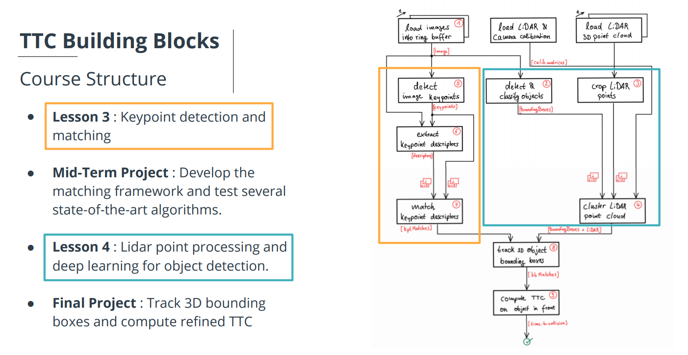

# SFND 3D Object Tracking

In this final project, The following tasks are implemented. 
1. match 3D objects over time by using keypoint correspondences. 
2. compute the TTC based on Lidar measurements. 
3. compute the TTC using the camera, which requires to first associate keypoint matches to regions of interest and then to compute the TTC based on those matches. 
4. identify the most suitable detector/descriptor combination for TTC estimation and also to search for problems that can lead to faulty measurements by the camera or Lidar sensor.

**To build the code**
<pre>
	mkdir build
	cd build
	cmake ..
	make
</pre>

**To Run**
<pre>
	./3D_object_tracking detectorType descriptorType matcherType matcherDescriptorType selectorType
</pre>

- detectorType - key point detector, values can be SHITOMASI, HARRIS, FAST, BRISK, ORB, AKAZE, SIFT, default is SHITOMASI.
- descriptorType - key point descriptors, values can be BRISK, BRIEF, ORB, FREAK, AKAZE, SIFT, default is BRISK.
- matcherType - matching algorithm, values can be MAT_BF, MAT_FLANN, default is MAT_BF.
- matcherDescriptorType - matcher descriptor type, values can be DES_BINARY, DES_HOG, default is DES_BINARY.
- selectorType - matcher selection type, values can be SEL_NN, SEL_KNN, default is SEL_NN.

## FP.1 : Match 3D Objects

matchBoundingBoxes method was implemented, which takes as input both the previous and the current data frames and provides as output the ids of the matched regions of interest (i.e. the boxID property)“. The highest number of keypoint correspondences is taken as the matches.

<pre>
void matchBoundingBoxes(std::vector<cv::DMatch> &matches, std::map<int, int> &bbBestMatches, DataFrame &prevFrame, DataFrame &currFrame)
{
    //map of the frequency count for prev box id and curr box id combination
    std::map<int, map<int, int>> counts;
    for (const auto& match : matches)
    {
        const auto& curr_pt = currFrame.keypoints[match.trainIdx].pt;
        const auto& prev_pt = prevFrame.keypoints[match.queryIdx].pt;
        for (const BoundingBox& prev_bounding_box : prevFrame.boundingBoxes)
        {
            for (const BoundingBox& curr_bounding_box : currFrame.boundingBoxes)
            {
                if (prev_bounding_box.roi.contains(prev_pt) &&
                    curr_bounding_box.roi.contains(curr_pt))
                {
                    std::map<int, int>& currmap = counts[prev_bounding_box.boxID];
                    currmap[curr_bounding_box.boxID] += 1;
                }
            }
        }
    }
    //find the best match bounding box
    for (auto entry : counts)
    {
        int prev_box_id = entry.first;
        const std::map<int, int>& currmap = entry.second;
        auto max = std::max_element(currmap.begin(), currmap.end(), 
                      ->bool { return a.second < b.second; });
        bbBestMatches[prev_box_id] = max->first;
    }
}	
</pre>

## FP.2 : Compute Lidar-based TTC

Compute the time-to-collision for all matched 3D objects based on Lidar measurements alone. To guard against outliers, it first remove those measurements which is outside the ego lane, and then the estimates of the TTC is calculated by using the median of the previous and current position using the formula.

TTC = curr_pos * dt/fabs(prev_pos - curr_pos)

<pre>
void computeTTCLidar(std::vector<LidarPoint> &lidarPointsPrev,
                     std::vector<LidarPoint> &lidarPointsCurr, double frameRate, double &TTC)
{
    double dt = 1.0/frameRate;
    double lanewidth = 4.0; //width of lane

    //remove those points that doesn't belong to the ego lane
    vector<double> prev_lidar_points;
    for (auto& pt : lidarPointsPrev)
        if (fabs(pt.y) <= lanewidth/2.0)
	    prev_lidar_points.push_back(pt.x);
    vector<double> curr_lidar_points;
    for (auto& pt : lidarPointsCurr)
        if (fabs(pt.y) <= lanewidth/2.0)
	    curr_lidar_points.push_back(pt.x);
   //use median to minimize the effect of outliers
   double prev_pos = median(prev_lidar_points);
   double curr_pos = median(curr_lidar_points);

   TTC = curr_pos * dt/fabs(prev_pos - curr_pos);   
}	
</pre>

## FP.3 : Associate Keypoint Correspondences with Bounding Boxes

Find all keypoint matches that belong to each 3D object, by simply checking wether the corresponding keypoints are within the region of interest in the camera image. However there is a problem with outliers. To eliminate those, first the median of the population is calculated, and the threshold is calculated based on the difference in distance covering 50% vs 60% of the population as below in the code.
<pre>
// associate a given bounding box with the keypoints it contains
void clusterKptMatchesWithROI(BoundingBox &boundingBox, std::vector<cv::KeyPoint> &kptsPrev, std::vector<cv::KeyPoint> &kptsCurr, std::vector<cv::DMatch> &kptMatches)
{
    //clear bounding box and keypoints on boundingbox
    boundingBox.keypoints.clear();
    boundingBox.kptMatches.clear();

    vector<pair<double,int>> distances;
    for (int i = 0; i < kptMatches.size(); ++i)
    {
	const auto& match = kptMatches[i];
        if (!boundingBox.roi.contains(kptsCurr[match.trainIdx].pt))
	    continue;
	double d = cv::norm(kptsCurr[match.trainIdx].pt - kptsPrev[match.queryIdx].pt);
        distances.push_back(make_pair(d, i)); 
    }
    //sort the distance based on the first element in pair
    sort(distances.begin(), distances.end());
    //calculate the distance between the 60% to 50% entry, and
    //use this to estimate the threshold to filter out points that
    //is too far off
    double dist_50 = distances[(int)(0.5*distances.size())].first;
    double dist_60 = distances[(int)(0.6*distances.size())].first;
    double threshold = dist_60 + (dist_60 - dist_50)*4;
    for (int i = 0; i < distances.size(); ++i)
    {
        //skip points that are too far
        if (distances[i].first > threshold)
           break; //distance in sorted order

        int matchIndex = distances[i].second;
        int keypointIdx = kptMatches[matchIndex].trainIdx;
        boundingBox.keypoints.push_back(kptsCurr[keypointIdx]);
        boundingBox.kptMatches.push_back(kptMatches[matchIndex]);
    }
}

</pre>

## FP.4 : Compute Camera-based TTC
The TTC is calculated as

TTC = -dt/(1 - medianDistRatio)

<pre>
void computeTTCCamera(std::vector<cv::KeyPoint> &kptsPrev, std::vector<cv::KeyPoint> &kptsCurr, 
                      std::vector<cv::DMatch> kptMatches, double frameRate, double &TTC, cv::Mat *visImg)
{
    vector<double> distRatios; // stores the distance ratios for all keypoints between curr. and prev. frame
    for (auto it1 = kptMatches.begin(); it1 != kptMatches.end() - 1; ++it1)
    { // outer kpt. loop

        // get current keypoint and its matched partner in the prev. frame
        cv::KeyPoint kpOuterCurr = kptsCurr.at(it1->trainIdx);
        cv::KeyPoint kpOuterPrev = kptsPrev.at(it1->queryIdx);

        for (auto it2 = kptMatches.begin() + 1; it2 != kptMatches.end(); ++it2)
        { // inner kpt.-loop

            double minDist = 100.0; // min. required distance

            // get next keypoint and its matched partner in the prev. frame
            cv::KeyPoint kpInnerCurr = kptsCurr.at(it2->trainIdx);
            cv::KeyPoint kpInnerPrev = kptsPrev.at(it2->queryIdx);

            // compute distances and distance ratios
            double distCurr = cv::norm(kpOuterCurr.pt - kpInnerCurr.pt);
            double distPrev = cv::norm(kpOuterPrev.pt - kpInnerPrev.pt);

            if (distPrev > std::numeric_limits<double>::epsilon() && distCurr >= minDist)
            { // avoid division by zero

                double distRatio = distCurr / distPrev;
                distRatios.push_back(distRatio);
            }
        } // eof inner loop over all matched kpts
    }     // eof outer loop over all matched kpts

    // only continue if list of distance ratios is not empty
    if (distRatios.size() == 0)
    {
        TTC = NAN;
        return;
    }

    std::sort(distRatios.begin(), distRatios.end());
    long medIndex = floor(distRatios.size() / 2.0);
    double medDistRatio = distRatios.size() % 2 == 0 ? (distRatios[medIndex - 1] + distRatios[medIndex]) / 2.0 : distRatios[medIndex]; // compute median dist. ratio to remove outlier influence

    double dT = 1 / frameRate;
    TTC = -dT / (1 - medDistRatio);
}
</pre>

## FP.5 : Performance Evaluation 1

This exercise is about conducting tests with the final project code, especially with regard to the Lidar part. Look for several examples where you have the impression that the Lidar-based TTC estimate is way off. Once you have found those, describe your observations and provide a sound argumentation why you think this happened.

the lidar TTC is as follows

| Image | TTC | xmin |
| ----- | --- | ---- |
| 1 | 12.5156 | 7.91 |
| 2 | 12.6142 | 7.85 |
| 3 | 14.091 | 7.79 |
| 4 | 16.6894 | 7.68 |
| 5 | 15.7465 | 7.64 |
| 6 | 12.7835 | 7.58 |
| 7 | 11.9844 | 7.55 |
| 8 | 13.1241 | 7.47 |
| 9 | 13.0241 | 7.43 |
| 10 | 11.1746 | 7.39 |
| 11 | 12.8086 | 7.20 |
| 12 | 8.95978 | 7.27 |
| 13 | 9.96439 | 7.19 |
| 14 | 9.59863 | 7.13 |
| 15 | 8.52157 | 7.04 |
| 16 | 9.51552 | 6.83 |
| 17 | 9.61241 | 6.90 |
| 18 | 8.3988 | 6.81 |

comparing image 10 and 11, the xmin drops from 7.39 to 7.20. but the TTC from lidar measurement increases from 11 to about 13 seconds. Notice there is a red light ahead, the car, the car has to be stationary or moving slowly. Hence the distance moved between current and previous frame is very small, therefore any small error in measuring the distance will be magnified in calculating the TTC for lidar.

image 10

image 11

## FP.6 : Performance Evaluation 2

TTC for camera and lidar for various detector/descriptor combination is as follows for the best detector/descriptor found in 2D exercise. For image 5 it can be seem for FAST/BRIEF and FAST/ORB the TTC calculaed from camera is INF. While FAST/BRISK has a very large value as compared to frame 4 or 6. This is due to the way we calculates TTC = -dt/(1-meddistratio), when the distance ratio is very close to 1, i.e the previous distance and current distance are almost same, the calculated TTC will be very sensitive to small error. In this case there will be large variation in calculated TTC.

So in this sense, FAST/BRISK seems to be performing better in this case, and the value is also more consistent w lidar TTC.

1. FAST/BRIEF

| image | TTC/Lidar | TTC/Camera |
| ----- | --------- | ---------- |
| 1 | 12.5156 | 12.366|
| 2 | 12.6142 | 13.0198|
| 3 | 14.091 | 20.9822|
| 4 | 16.6894 | 15.4321|
| 5 | 15.7465 | -inf|
| 6 | 12.7835 | 66.0229|
| 7 | 11.9844 | 13.4681|
| 8 | 13.1241 | 12.4699|
| 9 | 13.0241 | 13.9231|
| 10 | 11.1746 | 18.4604|
| 11 | 12.8086 | 13.8676|
| 12 | 8.95978 | 13.3698|
| 13 | 9.96439 | 13.403|
| 14 | 9.59863 | 11.438|
| 15 | 8.52157 | 11.7805|
| 16 | 9.51552 | 15.8061|
| 17 | 9.61241 | 8.35879|
| 18 | 8.3988 | 13.7908|

2. FAST/ORB

| image | TTC/Lidar | TTC/Camera |
| ----- | --------- | ---------- |
| 1 | 12.5156 | 12.5|
| 2 | 12.6142 | 12.2522|
| 3 | 14.091 | 23.8513|
| 4 | 16.6894 | 15.3774|
| 5 | 15.7465 | -inf|
| 6 | 12.7835 | 66.0229|
| 7 | 11.9844 | 13.9829|
| 8 | 13.1241 | 12.3413|
| 9 | 13.0241 | 13.93|
| 10 | 11.1746 | 19.0562|
| 11 | 12.8086 | 13.7875|
| 12 | 8.95978 | 11.5078|
| 13 | 9.96439 | 13.5472|
| 14 | 9.59863 | 11.2061|
| 15 | 8.52157 | 11.5971|
| 16 | 9.51552 | 12.1722|
| 17 | 9.61241 | 11.9072|
| 18 | 8.3988 | 13.7908|

3. FAST/BRISK

| image | TTC/Lidar | TTC/Camera |
| ----- | --------- | ---------- |
| 1 | 12.5156 | 12.478|
| 2 | 12.6142 | 12.0628|
| 3 | 14.091 | 18.6598|
| 4 | 16.6894 | 14.1389|
| 5 | 15.7465 | 56.3064|
| 6 | 12.7835 | 13.0932|
| 7 | 11.9844 | 14.4714|
| 8 | 13.1241 | 11.8157|
| 9 | 13.0241 | 13.0287|
| 10 | 11.1746 | 13.4693|
| 11 | 12.8086 | 13.788|
| 12 | 8.95978 | 11.6203|
| 13 | 9.96439 | 12.0215|
| 14 | 9.59863 | 11.6815|
| 15 | 8.52157 | 10.9473|
| 16 | 9.51552 | 12.095|
| 17 | 9.61241 | 11.3018|
| 18 | 8.3988 | 11.9301|

