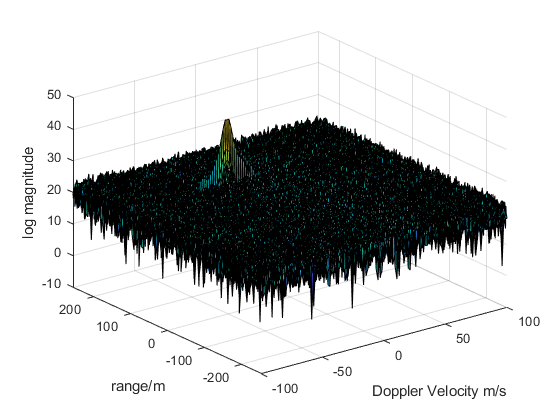
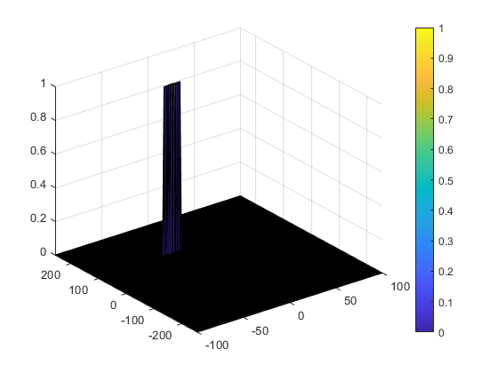

# Radar Target Generation and Detection

## Radar System Requirements

| property | Value |
| -------- | ----- |
| Frequency | 77 GHz |
| Range Resolution | 1 m |
| Max Range | 200 m |
| Max Velocity | 70 m/s |
| Velocity Resolution | 3 m/s |

### Max Range and Range Resolution will be considered here for waveform design.

- The sweep bandwidth can be determined according to the range resolution and the sweep slope is calculated using both sweep bandwidth and sweep time.

    Bandwidth(Bsweep) = speed of light/(2∗rangeResolution)

- The sweep time can be computed based on the time needed for the signal to travel the unambiguous maximum range. In general, for an FMCW radar system, the sweep time should be at least 5 to 6 times the round trip time. This example uses a factor of 5.5.

    Tchirp = 5.5 * 2 * Rmax/c

    Giving the slope of the chirp signal

    Slope = Bandwidth/Tchirp

### Initial Range and velocity of the Target

The initial Range cannot exceed the max value of 200m and velocity can be any value in the range of -70 to + 70 m/s. And in the project, the initial distance of the target is set to be 110 m, and velocity = -20 m/s

from the requirement, Bandwith(Bsweep) = 1.5e8, Tchirp = 7.333e-6, Slope = 2.0455e13

### Range Doppler Map

### 2D CFAR

- The number of Training cells, guard cells for each dimension is as follows

    %number of Training Cells in both the dimensions.
    - Tr = 10;
    - Td = 8;

    %number of Guard Cells in both dimensions around the Cell under 
    - Gr = 4;
    - Gd = 4;

    % offset the threshold by SNR value in dB
    - offset = 6;

- Slide the cell under test across the complete matrix. Make sure the CUT has margin for Training and Guard cells from the edges.
- For every iteration sum the signal level within all the training cells. To sum convert the value from logarithmic to linear using db2pow function.
- Average the summed values for all of the training cells used. After averaging convert it back to logarithmic using pow2db.
- Further add the offset to it to determine the threshold.
- Next, compare the signal under CUT against this threshold.
- If the CUT level > threshold assign it a value of 1, else equate it to 0.

### Non Threshold cell

The process above will generate a thresholded block, which is smaller than the Range Doppler Map as the CUTs cannot be located at the edges of the matrix due to the presence of Target and Guard cells. Hence, those cells will not be thresholded.

To keep the map size same as it was before CFAR, equate all the non-thresholded cells to 0.

